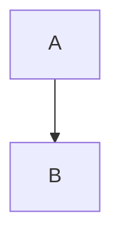

# Guide

Intro with *emphasis*, **strong**, ~~gone~~, `code`, an escaped \*star\* and &amp; entity.
A soft break, then a hard one\
next line<br>after a br tag, <kbd>Ctrl</kbd> key.

## Links

- [home](../README.md) and [install](../README.md#install) and [top](../README.md#home)
- [api, any case](API.md) and [missing heading](api.md#nowhere)
- [same page](#tables) and [web](https://example.com/x?y=1) and <https://auto.example> and <me@example.com>
- [not synced](../notes/skip.md) and [outside](../../other.md) and [spec](spec.pdf)

## Images


  


<p align="center"></p>

<!--  -->

<div>not kept</div>

## Tables

| Left | Centre | Right | None |
|:-----|:------:|------:|------|
| a    | b      | c     | d    |

## Lists

1. one
2. two

3. three
   - nested

- [x] done
- [ ] open

* [x] mixed
* plain

+ [ ] task with

  a paragraph nested under it

```go
fmt.Println("hi")
```



    indented code

> quoted
>
> ### Quoted heading

---
